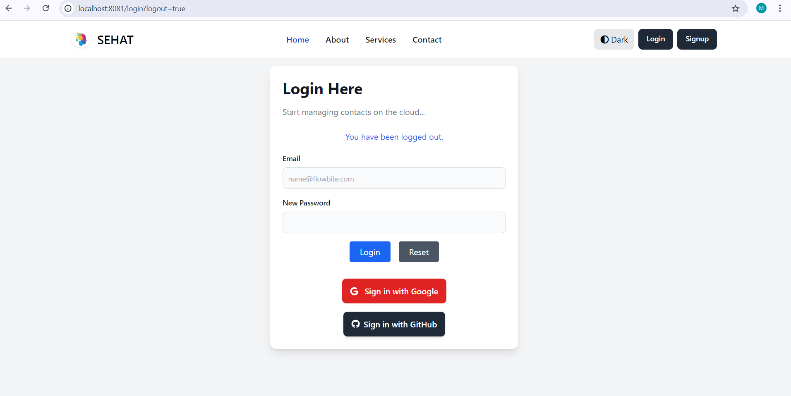
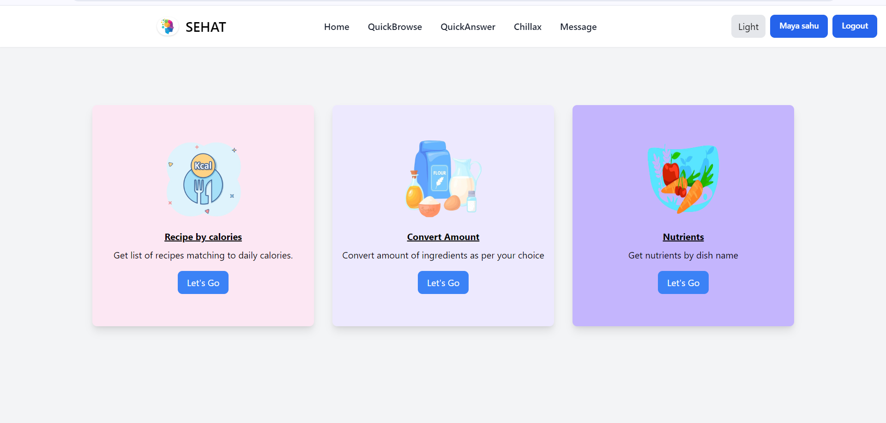
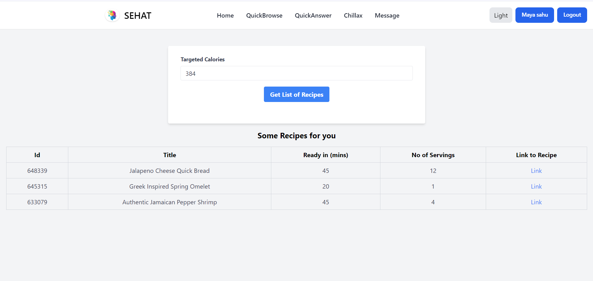

# 🧘 Welcome to **SEHAT** — Your Ultimate Health & Wellness Platform

**SEHAT** is a comprehensive platform designed to support all your health and wellness goals. Whether you're a fitness enthusiast, a mindful eater, or simply looking to improve your lifestyle, SEHAT brings together everything you need in one place.

---

## 🔐 Authentication Options

We offer secure and seamless login/signup options to enhance user experience:

### 👉 Google Login/Signup  
  
Quickly access SEHAT using your Google account. Just click the Google button to authenticate securely — no need to remember new credentials!

### 👉 GitHub Login  
Prefer GitHub? You're covered. Authenticate using your GitHub account with the same ease and security.

### 👉 Email Registration  
  
You can also register using your Gmail ID and a custom password. Choose what works best for you!

---

## 🧑‍🏫 For Fitness Professionals

Are you a **gym trainer** or **yoga instructor**? SEHAT offers a platform to:

- Showcase your expertise  
- Get discovered by clients  
- Build your professional presence online  

Your profile will be visible to all users, helping you grow your outreach and connect with new clients.

---

## 🔍 QuickBrowse – Find Food Data Instantly

Curious about:
- What ingredients are in your favorite homemade food?
- How many nutrients are in a dish?
- Which recipes match a calorie limit?

**QuickBrowse** is your go-to feature for exploring nutritional data in seconds.

---

## 🥗 Calorie-Based Recipe Search

Staying on track with your calorie goals just got easier:

- Enter a desired calorie count (e.g., **394 calories**)
- Instantly find delicious recipes matching your input

No more guesswork — SEHAT helps you stay in control of your diet.

---

## 🍉 Explore Natural Nutrients in Fruits

Want to know what’s inside your favorite fruits?

- Vitamins in oranges  
- Antioxidants in berries  
- Fiber in bananas  

**SEHAT** gives you **comprehensive fruit nutrient breakdowns** to support smart eating decisions.

---

## 💬 Ask & Explore with SEHAT

Have questions about health, fitness, or diet?

- Use our **search feature** to explore curated answers
- Learn about exercise benefits, meal plans, and more

**SEHAT** is your personal wellness knowledge center.

---

## 😄 Chillax — Relax and Learn

Welcome to **Chillax** — your space to unwind!

- Enjoy lighthearted jokes  
- Explore fun food trivia  
- Learn quirky facts about nutrition  

Because health isn’t just about seriousness — it’s about balance and fun too.

---

### 🔗 GitHub Repository  
[https://github.com/Harshkumarsahu1/SEHAT2.0](https://github.com/Harshkumarsahu1/SEHAT2.0)
