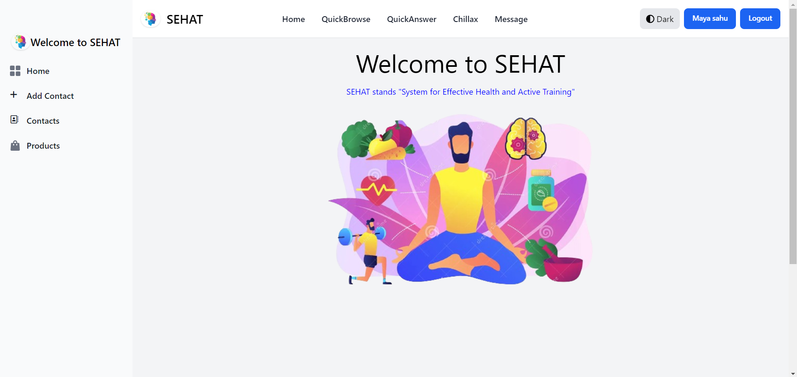
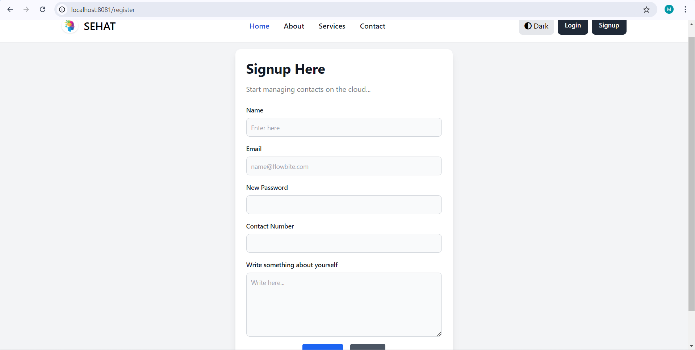
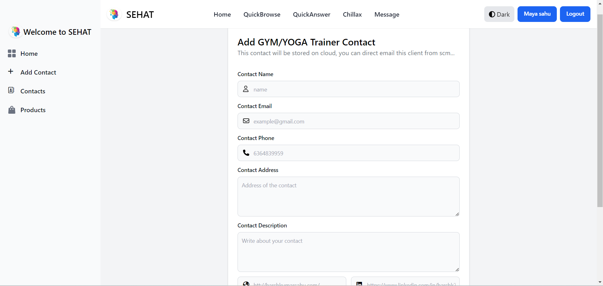
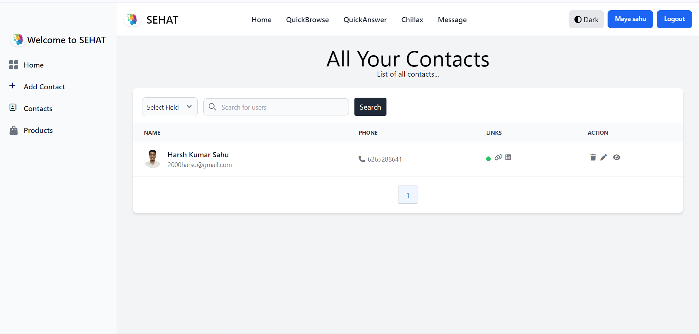
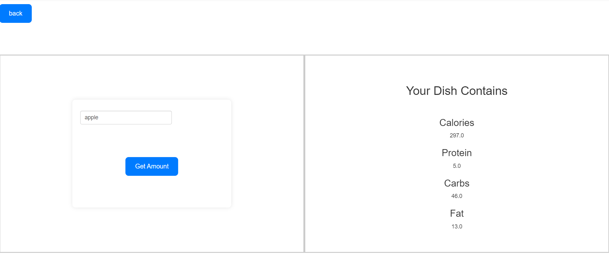
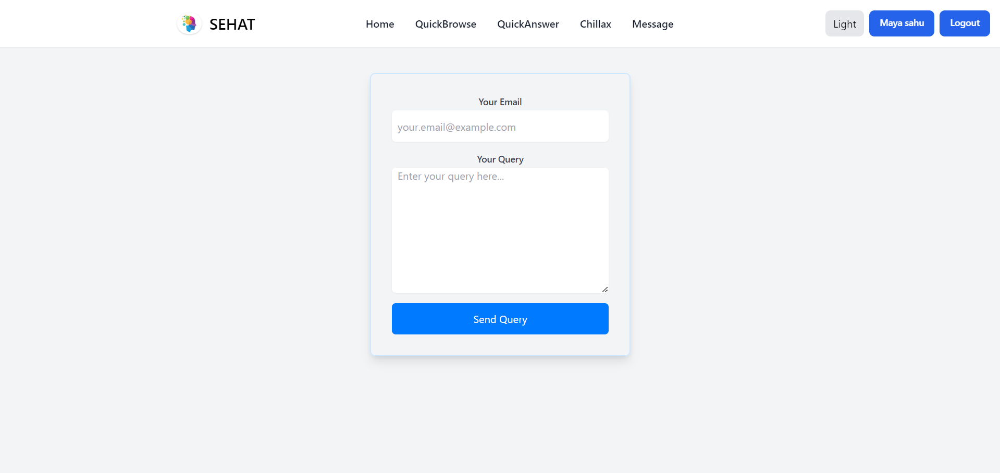

# Welcome to SEHAT - Your Ultimate Health & Wellness Platform

SEHAT is a comprehensive platform designed to cater to all your health and wellness needs, whether you’re a fitness enthusiast, a curious foodie, or someone looking to lead a healthier lifestyle.

## Authentication Options

To ensure a secure and seamless experience, we offer quick and easy login and signup options through Google and GitHub.

### Google Login/Signup
  
Use your Google account to access SEHAT instantly. Simply click the Google button to authenticate securely and start using the platform without the need to create a new account.

If you're a developer or prefer using your GitHub account, you can easily sign in with GitHub. This option provides you with the same level of security and ease of use, leveraging your existing GitHub credentials.
You can also register by your gmailId and set password

## For Fitness Professionals
  
Are you a gym trainer or a yoga instructor? SEHAT offers you the perfect opportunity to showcase your skills and connect with a wide audience. By registering on our platform, your profile will be visible to all users, making it easy for potential clients to discover and reach out to you. Whether you specialize in weight training, yoga, or any other fitness discipline, SEHAT is the place to grow your business and expand your reach.

## QuickBrowse 
if your want to know about recipe of dishes by given calorie or nutients in any dish or or incredients in home made food then this is for you

## Calorie-Specific Recipe Search
  
At SEHAT, we understand that managing your diet is key to achieving your health goals. That’s why we’ve made it simple for you to find the perfect recipe tailored to your calorie needs. Just enter the desired calorie count, and our smart search feature will provide you with a list of delicious recipes that match your criteria. Whether you’re aiming for 394 calories or any other specific amount, SEHAT has the recipe options you need to stay on track.

## Explore Natural Ingredients in Fruits
  
Curious about the natural ingredients in your favorite fruits? SEHAT allows you to search for detailed nutritional information about various fruits. Whether you want to know the vitamin content in an orange or the antioxidant levels in berries, our platform provides comprehensive data to help you make informed dietary choices.

## Ask and Explore with SEHAT
  
Got a question about health, fitness, or nutrition? SEHAT’s search feature is here to help. Simply type in your query, and discover a wealth of information tailored to your needs. From the benefits of different exercises to the best dietary practices, our platform is your go-to resource for all things health-related.

## Chillax - Relax and Learn
  
Life’s too short to be all serious. That’s why SEHAT features the “Chillax” section – a fun corner where you can unwind with jokes, food trivia, and interesting facts about nutrition. Whether you need a good laugh or want to learn something new in a lighthearted way, Chillax is here to brighten your day.

